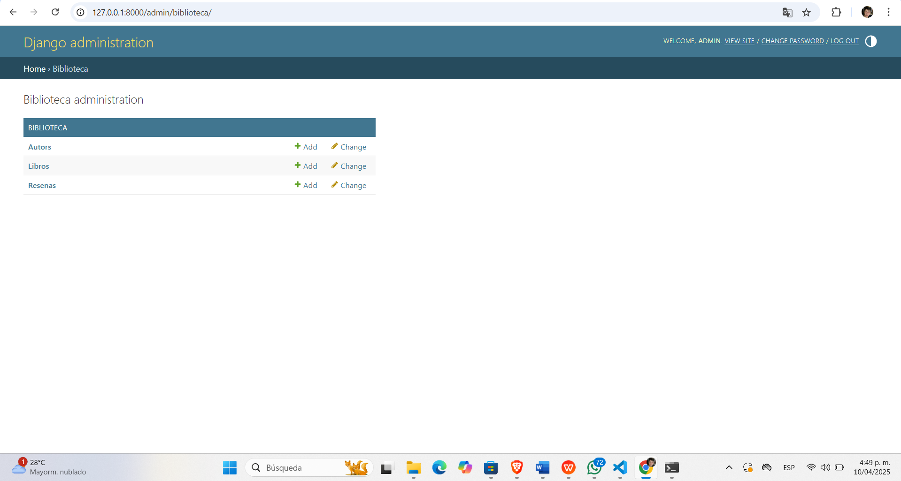
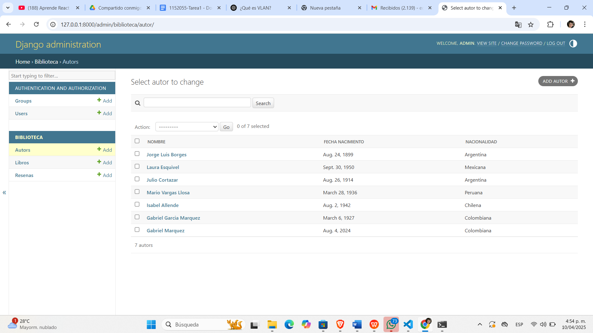
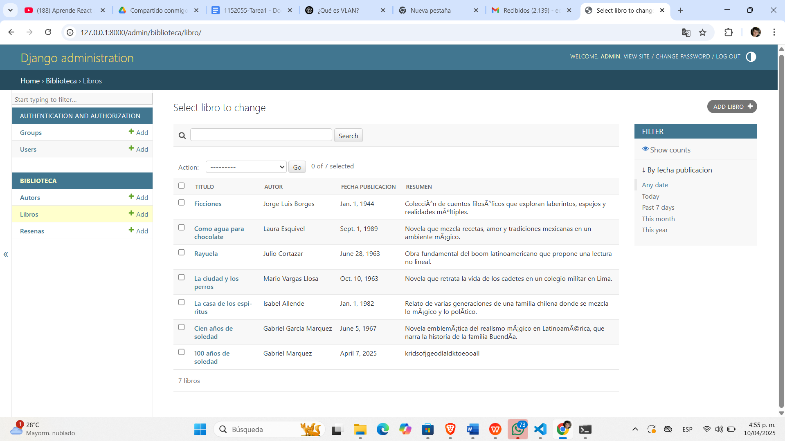
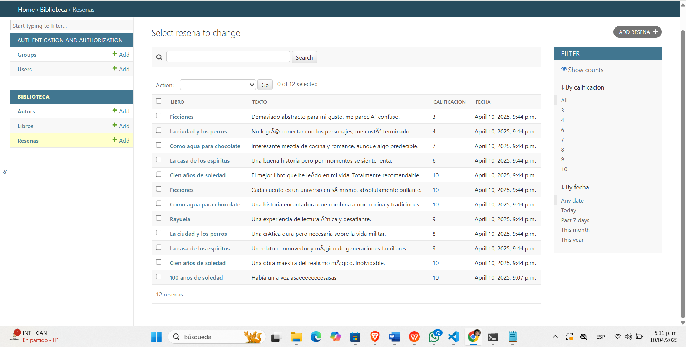
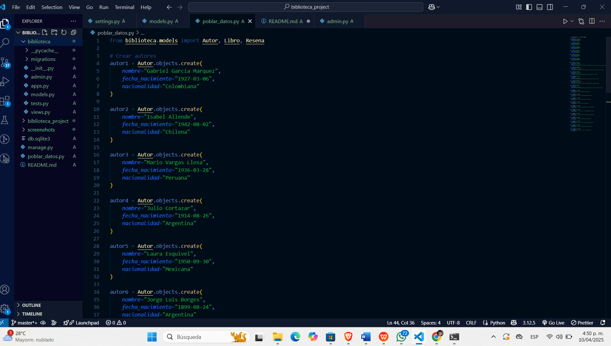
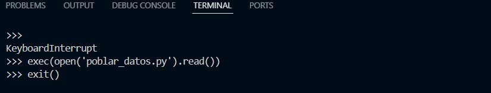

# 📚 Biblioteca Project

Proyecto web desarrollado con **Django** para gestionar autores, libros y reseñas.

## Funcionalidades

- Registro de **Autores**, **Libros** y **Reseñas** desde el panel de administración.
- Validaciones personalizadas.
- Relaciones entre entidades/modelos.

## Requisitos

- Python 3.8 o superior
- Django 4.x

## 📥 Instalación

1. **Clona el repositorio en alguna carpeta o en tu escritorio.**:

```bash
git clone https://github.com/tu-usuario/biblioteca_project.git
cd biblioteca_project
```

2. **Crea un entorno virtual (venv)**:

```bash
python -m venv venv
# Activar en Windows
venv\Scripts\activate
# Activar en Mac/Linux
source venv/bin/activate
```

3. **Instala las dependencias**:

```bash
pip install django
```

4. **Aplica las migraciones**:

```bash
python manage.py makemigrations
python manage.py migrate
```

5. **Crea un superusuario para acceder al panel de administración.**:

```bash
python manage.py createsuperuser
```

6. **Ejecuta el servidor**:

```bash
python manage.py runserver
```

7. **Ejecuta el script para poblar los datos de la base de datos de ejemplo (OPCIONAL)**:

```bash
exec(open('poblar_datos.py').read())
```

## Screenshots

## Panel de admin






## Script



## Script ejecutado



## ✍️ Créditos

Proyecto realizado para la materia de Programación Web.
Integrantes:

1. Edwin Andres Duarte Rodriguez - 1152055
2. Diego Alexander Bermudez Florez - 1152067
   Profesor: Daniel Andres Esteban Carrillo.
